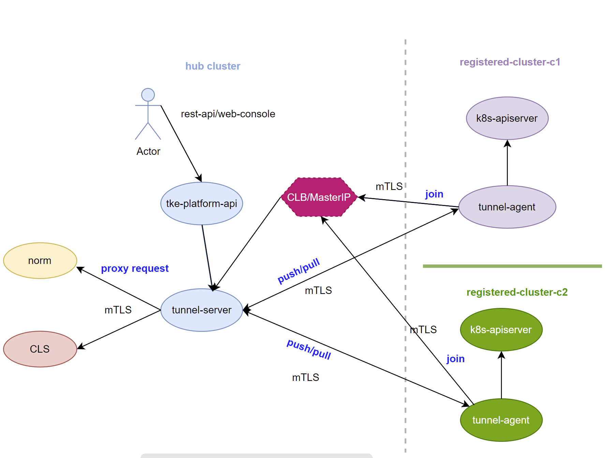

# tke-excalibur


## Glossary 

**Hub cluster**: The hub cluster is used to define the [central controller](https://github.com/tkestack/tke/tree/master/pkg/platform/controller/cluster) that runs in a Kubernetes cluster. The hub cluster aggregates information from multiple clusters by using an aggregates api server

**Registered cluster**: The registered cluster controlled by the hub cluster for life cycle management after registered to hub cluster

**ANP**:  The kubernates native project named apiserver network proxy, it provides a TCP level proxy for the control plane to cluster communication. It already build into core as the native kubernates `edge` network solution

**Registered cluster working mode**:   **Pull** and **Push**:  
 - **Pull**:  Registered cluster watches hub cluster api server to apply actions and manifests for management
 - **Push**:  Hub cluster access to registered cluster api server directly or by a reverse tunnel for management

## Background

The most of kubernates clusters reside in private IDC or public cloud such as `Tencent cloud`, `IBM cloud`, `Google cloud`, etc don't have `Inbound` network,  that cause hub cluster can't access to registered cluster api server to manage it directly,  but registered cluster can join to hub cluster by `Outbound`network.  This project aim to leverage open source project [ANP](https://github.com/kubernetes-sigs/apiserver-network-proxy/) to enable communication between hub cluster and registered cluster by a reverse tunnel for multi cloud `push` solution

## Features

1. Add reverse proxy to tunnel server so that `agent` add `add-on` service placed in managed cluster is able to access the service(such as `norm`) which in same flat network with tunnel server, with it, `tke-excalibur` support both `pull` and `push` mode.

2. Enhance certificate management, the tunnel server/agent certificate managed by hub cluster apiserver by `CSR` and support certificate rotation.

3. Enhanced deploy topology：

 - **1** tunnel server works for **N** tunnel agent for `public` cloud case 
 -  **1** tunnel server works for **1** tunnel agent for `private` cloud case
 - No `hostNetwork` dependency
 - In order to reduce security risk as much as possible,  only tunnel server **MUST** exposed to the public network for agent join
 
4. Add hook plug-in mechanism to execute customized logic so that support different user case

5. A new cluster type named `Registered` against existing `Baremetal` and `Imported` cluster,  that indicates the registered cluster join to hub cluster by tunnel agent

## Architecture



## Cluster register work workflow 


## Build binary

- build all binary  
```
make build
```
- make build specified binary  
```
make build BINS="excalibur-tunnel-server"
make build BINS="excalibur-tunnel-agent"
make build BINS="excalibur-tunnel-client"
```

## Build image

Take `excalibur-tunnel-server` as an example:

1. Set image repo and version ,  take `docker hub` as an example:
```
export REGISTRY_PREFIX=huxl
export VERSION=v0.3.0
```

2.  install `buildx` according to below link:

```
https://cloud.tencent.com/developer/article/1534675
```

3.  build image
```
make image.multiarch IMAGES="excalibur-tunnel-server excalibur-tunnel-agent" PLATFORMS="linux_amd64"
```

4.  push image
```
make manifest.multiarch IMAGES="excalibur-tunnel-server excalibur-tunnel-agent" PLATFORMS="linux_amd64"
```


## Deploy

The hub cluster deployed on the public cloud and registered cluster deployed on private IDC  according to 1:1 deploy topology,  hub cluster export tunnel server address by `nodePort` for agent join

`hub cluster`:

```
root@VM-0-80-ubuntu:~# kubectl get node
NAME         STATUS   ROLES    AGE     VERSION
10.0.0.127   Ready    master   12d   v1.18.3
10.0.0.197   Ready    master   12d   v1.18.3
10.0.0.80    Ready    master   12d   v1.18.3
```

`registered cluster`:

```
root@VM-0-77-ubuntu:~# kubectl get node
NAME          STATUS   ROLES    AGE    VERSION
172.22.0.77   Ready    master   4d9h   v1.19.7
root@VM-0-77-ubuntu:~# 
```

1. Deploy tunnel server to `hub cluster`

```
kubectl label nodes 10.0.0.80 platform.tkestack.io/is-tunnel-server=true
kubectl create -f config/setup/excalibur-tunnel-server.yaml
```

2. Get tunnel agent service account `ca` and `token` on `hub cluster`, then fill with corresponding section to secret `excalibur-tunnel-agent-secret` in `excalibur-tunnel-agent.yaml`

```
## ca.crt
kubectl -n tkestack get secret -o yaml $(sudo kubectl -n tkestack get secret | (grep excalibur-tunnel-agent-sa || echo "$_") | awk '{print $1}') | grep " ca.crt" | awk '{print $2}'

## token
kubectl -n tkestack describe secret $(sudo kubectl -n tkestack get secret | (grep excalibur-tunnel-agent || echo "$_") | awk '{print $1}') | grep token: | awk '{print $2}'|base64 -w 0
```

2. Deploy tunnel agent to `managed cluster`

```
kubectl  create -f config/setup/excalibur-tunnel-agent.yaml
```

## Tunnel test

The `managed cluster` doesn't have `inbound` network, so `Hub cluster` can't access to `managed cluster` directly for communication, but it has `outbound` network which can access to tunnel sever to setup a reverse tunnel, then `managed cluster` is able to communicate to `hub cluster` by this tunnel. The test client will leverage [ANP client](https://github.com/kubernetes-sigs/apiserver-network-proxy/tree/master/cmd/client) to verify tunnel works as excepted. To simplified the verification test case, the tunnel server and tunnel client are deployed to same pod and use same crt/key pairs to enable mTLS based communication

### case 1: HTTP-Connect client using mTLS Proxy with dial back Agent to Python based SimpleHTTPServer

```
client =HTTP-CONNECT=> (:10263) proxy (:10262) <=GRPC= agent =HTTP=> SimpleHTTPServer(:8000)
  |                                                    ^
  |                          Tunnel                    |
  +----------------------------------------------------+
```

1. Check the tunnel server and tunnel agent both in `Running` and ready to use

```
root@VM-0-80-ubuntu:~# kubectl get po -A |grep tunn
kube-system   excalibur-tunnel-server-7854c5c54f-n4nbp        1/1     Running   1          151m
root@VM-0-77-ubuntu:~# kubectl get po -A |grep tunn
kube-system   excalibur-tunnel-agent-7597c6dd89-ncg52         1/1     Running   0          81m
root@VM-0-77-ubuntu:~# 
```

2. Run python based HTTP server on `managed cluster`

```
root@VM-0-77-ubuntu:~# python -m SimpleHTTPServer
Serving HTTP on 0.0.0.0 port 8000 ...
```

3. Copy `excalibur-tunnel-client` binary (_output/local/bin/linux/amd64/) to tunnel server 

```
root@VM-0-80-ubuntu:~# kubectl cp excalibur-tunnel-client `kubectl get po -l k8s-app=excalibur-tunnel-server -n tkestack -o jsonpath="{.items[0].metadata.name}"`:/ -n tkestack 
```

4. Run client to get SimpleHTTPServer response by tunnel

```
root@VM-0-80-ubuntu:~# kubectl exec -it `kubectl get po  -l k8s-app=excalibur-tunnel-server -n tkestack -o jsonpath="{.items[0].metadata.name}"` -n tkestack sh
kubectl exec [POD] [COMMAND] is DEPRECATED and will be removed in a future version. Use kubectl exec [POD] -- [COMMAND] instead.
/ # ./excalibur-tunnel-client --ca-cert=/run/secrets/kubernetes.io/serviceaccount/ca.crt --client-cert=/var/lib/tunnel-server/pki/tunnel-server-current.pem    --client-key=./var/lib/tunnel-server/pki/tunnel-server-current.pem  --proxy-host=132.232.31.102  --proxy-port=31503 --mode=http-connect  --request-host=172.22.0.77  --request-port=8000 --request-path=""
I0228 23:40:17.032519     122 client.go:106] ClientCert set to "/var/lib/tunnel-server/pki/tunnel-server-current.pem".
I0228 23:40:17.032555     122 client.go:107] ClientKey set to "./var/lib/tunnel-server/pki/tunnel-server-current.pem".
I0228 23:40:17.032570     122 client.go:108] CACert set to "/run/secrets/kubernetes.io/serviceaccount/ca.crt".
I0228 23:40:17.032580     122 client.go:109] RequestProto set to "http".
I0228 23:40:17.032589     122 client.go:110] RequestPath set to "".
I0228 23:40:17.032598     122 client.go:111] RequestHost set to "172.22.0.77".
I0228 23:40:17.032607     122 client.go:112] RequestPort set to 8000.
I0228 23:40:17.032619     122 client.go:113] ProxyHost set to "132.232.31.102".
I0228 23:40:17.032633     122 client.go:114] ProxyPort set to 31503.
I0228 23:40:17.032641     122 client.go:115] ProxyUdsName set to "".
I0228 23:40:17.032655     122 client.go:116] TestRequests set to '\x01'.
I0228 23:40:17.032667     122 client.go:117] TestDelaySec set to 0.
I0228 23:40:17.195460     122 client.go:317] HTML Response:
<!DOCTYPE html PUBLIC "-//W3C//DTD HTML 3.2 Final//EN"><html>
<title>Directory listing for /</title>
<body>
<h2>Directory listing for /</h2>
<hr>
<ul>
<li><a href=".bash_history">.bash_history</a>
<li><a href=".bashrc">.bashrc</a>
<li><a href=".cache/">.cache/</a>
<li><a href=".docker/">.docker/</a>
<li><a href=".gnupg/">.gnupg/</a>
<li><a href=".kube/">.kube/</a>
<li><a href=".pip/">.pip/</a>
<li><a href=".profile">.profile</a>
<li><a href=".pydistutils.cfg">.pydistutils.cfg</a>
<li><a href=".ssh/">.ssh/</a>
<li><a href=".viminfo">.viminfo</a>
<li><a href="a">a</a>
<li><a href="clean.sh">clean.sh</a>
<li><a href="code-gen.tar">code-gen.tar</a>
<li><a href="download.kubeconfig">download.kubeconfig</a>
<li><a href="download2.kubeconfig">download2.kubeconfig</a>
<li><a href="download3.kubeconfig">download3.kubeconfig</a>
<li><a href="get_helm.sh">get_helm.sh</a>
<li><a href="ipv6-test/">ipv6-test/</a>
<li><a href="kubeadmconf.yml">kubeadmconf.yml</a>
<li><a href="kubeconfig">kubeconfig</a>
<li><a href="mcm/">mcm/</a>
<li><a href="sa.kubeconfig">sa.kubeconfig</a>
<li><a href="sa2.kubeconfig">sa2.kubeconfig</a>
<li><a href="update_api_san/">update_api_san/</a>
</ul>
<hr>
</body>
</html>

/ #
```

### case 2: HTTP-Connect client-go using mTLS Proxy with dial back Agent to K8S API server

```
client =HTTP-CONNECT=> (:10263) proxy (:10262) <=GRPC= agent =HTTP=> K8S API server(:6443)
  |                                                    ^
  |                          Tunnel                    |
  +----------------------------------------------------+
```


2. Base on case 1, copy `kubeconfig` binary to tunnel server pod

```
## get admin token
root@VM-0-77-ubuntu:~#sudo kubectl -n tkestack describe secret $(sudo kubectl -n tkestack get secret | (grep excalibur-tunnel-agent-sa-token || echo "$_") | awk '{print $1}') | grep token: | awk '{print $2}'

root@VM-0-77-ubuntu:~/mcm/excalibur# cat kubeconfig
apiVersion: v1
kind: Config
clusters:
- name: default-cluster
  cluster:
    insecure-skip-tls-verify: true
    server: https://172.22.0.77:6443
contexts:
- name: default-context
  context:
    cluster: default-cluster
    user: default-user
current-context: default-context
users:
- name: default-user
  user:
    token: <admin-token>
root@VM-0-80-ubuntu:~/mcm/excalibur# kubectl cp kubeconfig `kubectl get po -l k8s-app=excalibur-tunnel-server -n tkestack -o jsonpath="{.items[0].metadata.name}"`:/ -n tkestack         
root@VM-0-80-ubuntu:~/mcm/excalibur# 

```

3. Run client to get all pods from managed cluster by tunnel

```
root@VM-0-80-ubuntu:~/mcm/excalibur# kubectl exec -it `kubectl get po  -l k8s-app=excalibur-tunnel-server -n tkestack -o jsonpath="{.items[0].metadata.name}"` -n tkestack sh           
kubectl exec [POD] [COMMAND] is DEPRECATED and will be removed in a future version. Use kubectl exec [POD] -- [COMMAND] instead.
/ # ./excalibur-tunnel-client --ca-cert=/run/secrets/kubernetes.io/serviceaccount/ca.crt --client-cert=/var/lib/tunnel-server/pki/tunnel-server-current.pem    --client-key=/var/lib/tunnel-server/pki/tunnel-server-current.pem  --proxy-host=132.232.31.102  --proxy-port=31503 --mode=http-connect  --request-host=kubernetes.default --request-port=443 --kubeconfig=./kubeconfig
I0301 01:11:04.638863     114 client.go:106] ClientCert set to "/var/lib/tunnel-server/pki/tunnel-server-current.pem".
I0301 01:11:04.638888     114 client.go:107] ClientKey set to "/var/lib/tunnel-server/pki/tunnel-server-current.pem".
I0301 01:11:04.638903     114 client.go:108] CACert set to "/run/secrets/kubernetes.io/serviceaccount/ca.crt".
I0301 01:11:04.638918     114 client.go:109] RequestProto set to "http".
I0301 01:11:04.638929     114 client.go:110] RequestPath set to "success".
I0301 01:11:04.638940     114 client.go:111] RequestHost set to "cls-t8gz6mgd".
I0301 01:11:04.638950     114 client.go:112] RequestPort set to 6443.
I0301 01:11:04.638960     114 client.go:113] ProxyHost set to "132.232.31.102".
I0301 01:11:04.638969     114 client.go:114] ProxyPort set to 31503.
I0301 01:11:04.638980     114 client.go:115] ProxyUdsName set to "".
I0301 01:11:04.638990     114 client.go:116] TestRequests set to '\x01'.
I0301 01:11:04.639001     114 client.go:117] TestDelaySec set to 0.
Pod 1: coredns-745589f8f6-ld9x2
Pod 2: coredns-745589f8f6-tmzwn
Pod 3: etcd-172.22.0.77
Pod 4: flannel-b7t6n
Pod 5: galaxy-daemonset-75wq4
Pod 6: kube-apiserver-172.22.0.77
Pod 7: kube-controller-manager-172.22.0.77
Pod 8: kube-proxy-gfmhz
Pod 9: kube-scheduler-172.22.0.77
Pod 10: metrics-server-v0.3.6-794ccd69c8-nhmpd
Pod 11: excalibur-tunnel-agent-55889f9c5c-jqwzs
Pod 12: influxdb-0
Pod 13: tke-auth-api-5ddc987db5-6k9vq
Pod 14: tke-auth-api-5ddc987db5-z62s9
Pod 15: tke-auth-controller-6ff7879977-l6vml
Pod 16: tke-auth-controller-6ff7879977-rh9wq
Pod 17: tke-business-api-8c5f97868-6m2s2
Pod 18: tke-business-api-8c5f97868-xjh5j
Pod 19: tke-business-controller-f7f566849-rf54k
Pod 20: tke-business-controller-f7f566849-sj8n7
Pod 21: tke-gateway-v87xk
Pod 22: tke-logagent-api-78d6dbf74c-7xr52
Pod 23: tke-logagent-api-78d6dbf74c-rjngh
Pod 24: tke-logagent-controller-69cf4c6ff6-skftg
Pod 25: tke-logagent-controller-69cf4c6ff6-wnq9v
Pod 26: tke-monitor-api-97bb64745-945kv
Pod 27: tke-monitor-api-97bb64745-c6q6h
Pod 28: tke-monitor-controller-6d4ccb5d58-b4tcx
Pod 29: tke-monitor-controller-6d4ccb5d58-tpbm7
Pod 30: tke-notify-api-7757658446-c559n
Pod 31: tke-notify-api-7757658446-qj2zb
Pod 32: tke-notify-controller-846dc87846-8c792
Pod 33: tke-notify-controller-846dc87846-f5fnk
Pod 34: tke-platform-api-5c854779d-8j4x4
Pod 35: tke-platform-api-5c854779d-j74b4
Pod 36: tke-platform-controller-6d76dd7dc7-cbfmp
Pod 37: tke-platform-controller-6d76dd7dc7-sgrph
Pod 38: tke-registry-api-648bc48d9c-lcffc
Pod 39: tke-registry-api-648bc48d9c-s5286
Pod 40: tke-registry-controller-7bfb4799d8-tdhbk
Pod 41: tke-registry-controller-7bfb4799d8-ttt2n
/ # 
```

### case 3: GRPC+UDS Client using Proxy with dial back Agent to K8S API server
```
client =HTTP over GRPC+UDS=> (/tmp/uds-proxy) proxy (:10262) <=GRPC= agent =HTTP=> K8S API server(:6443)
  |                                                    ^
  |                          Tunnel                    |
  +----------------------------------------------------+
```

1. Base on case 2,  add `--uds-name=/tmp/uds-proxy` by `kubectl edit deployment tke-excalibur-server -n tkestack` on `managed cluster`

```
         - --bind-address=0.0.0.0
         - --cert-ips=132.232.31.102,139.155.48.141,139.155.57.224
         - --proxy-strategy=default
+        - --uds-name=/tmp/proxy-master
         - --v=4

```

2. Run client to get all pods from registered cluster by tunnel

```
root@VM-0-80-ubuntu:~/mcm/excalibur# kubectl cp excalibur-tunnel-client `kubectl get po -l k8s-app=excalibur-tunnel-server -n tkestack -o jsonpath="{.items[0].metadata.name}"`:/ -n tkestack  
root@VM-0-80-ubuntu:~/mcm/excalibur# kubectl cp kubeconfig `kubectl get po -l k8s-app=excalibur-tunnel-server -n tkestack -o jsonpath="{.items[0].metadata.name}"`:/ -n tkestack  
root@VM-0-80-ubuntu:~/mcm/excalibur# kubectl exec -it `kubectl get po  -l k8s-app=excalibur-tunnel-server -n tkestack -o jsonpath="{.items[0].metadata.name}"` -n tkestack sh
kubectl exec [POD] [COMMAND] is DEPRECATED and will be removed in a future version. Use kubectl exec [POD] -- [COMMAND] instead.
/ # ./excalibur-tunnel-client  --proxy-uds=/tmp/proxy-master --proxy-host=""  --proxy-port=0 --mode=http-connect  --request-host=kubernetes.default  --request-port=443 --kubeconfig=./kubeconfig
I0302 08:52:56.592649     243 client.go:106] ClientCert set to "".
I0302 08:52:56.592690     243 client.go:107] ClientKey set to "".
I0302 08:52:56.592708     243 client.go:108] CACert set to "".
I0302 08:52:56.592733     243 client.go:109] RequestProto set to "http".
I0302 08:52:56.592743     243 client.go:110] RequestPath set to "success".
I0302 08:52:56.592754     243 client.go:111] RequestHost set to "cls-gd97k5dx".
I0302 08:52:56.592767     243 client.go:112] RequestPort set to 6443.
I0302 08:52:56.592779     243 client.go:113] ProxyHost set to "".
I0302 08:52:56.592790     243 client.go:114] ProxyPort set to 0.
I0302 08:52:56.592807     243 client.go:115] ProxyUdsName set to "/tmp/proxy-master".
I0302 08:52:56.592820     243 client.go:116] TestRequests set to '\x01'.
I0302 08:52:56.592828     243 client.go:117] TestDelaySec set to 0.
Pod 1: coredns-745589f8f6-ld9x2
Pod 2: coredns-745589f8f6-tmzwn
Pod 3: etcd-172.22.0.77
Pod 4: flannel-b7t6n
Pod 5: galaxy-daemonset-75wq4
Pod 6: kube-apiserver-172.22.0.77
Pod 7: kube-controller-manager-172.22.0.77
Pod 8: kube-proxy-gfmhz
Pod 9: kube-scheduler-172.22.0.77
Pod 10: metrics-server-v0.3.6-794ccd69c8-nhmpd
Pod 11: excalibur-tunnel-agent-6bc94c58f7-gg458
Pod 12: influxdb-0
Pod 13: tke-auth-api-5ddc987db5-6k9vq
Pod 14: tke-auth-api-5ddc987db5-z62s9
Pod 15: tke-auth-controller-6ff7879977-l6vml
Pod 16: tke-auth-controller-6ff7879977-rh9wq
Pod 17: tke-business-api-8c5f97868-6m2s2
Pod 18: tke-business-api-8c5f97868-xjh5j
Pod 19: tke-business-controller-f7f566849-rf54k
Pod 20: tke-business-controller-f7f566849-sj8n7
Pod 21: tke-gateway-v87xk
Pod 22: tke-logagent-api-78d6dbf74c-7xr52
Pod 23: tke-logagent-api-78d6dbf74c-rjngh
Pod 24: tke-logagent-controller-69cf4c6ff6-skftg
Pod 25: tke-logagent-controller-69cf4c6ff6-wnq9v
Pod 26: tke-monitor-api-97bb64745-945kv
Pod 27: tke-monitor-api-97bb64745-c6q6h
Pod 28: tke-monitor-controller-6d4ccb5d58-b4tcx
Pod 29: tke-monitor-controller-6d4ccb5d58-tpbm7
Pod 30: tke-notify-api-7757658446-c559n
Pod 31: tke-notify-api-7757658446-qj2zb
Pod 32: tke-notify-controller-846dc87846-8c792
Pod 33: tke-notify-controller-846dc87846-f5fnk
Pod 34: tke-platform-api-5c854779d-8j4x4
Pod 35: tke-platform-api-5c854779d-j74b4
Pod 36: tke-platform-controller-6d76dd7dc7-cbfmp
Pod 37: tke-platform-controller-6d76dd7dc7-sgrph
Pod 38: tke-registry-api-648bc48d9c-lcffc
Pod 39: tke-registry-api-648bc48d9c-s5286
Pod 40: tke-registry-controller-7bfb4799d8-tdhbk
Pod 41: tke-registry-controller-7bfb4799d8-ttt2n
/ # 
```

## Hook

Currently, only support `PreStartTunnelAgent` and `PostStartTunnelAgent` hook to execute customized logic for different  cloud provider, for example:

1. Tunnel agent responsible for report the registered cluster `admin` token to Tunnel server and persist it to global/meta cluster so that `tke-platform` use it to create k8s `ClientSet` to operator managed cluster, `tke` and `tkestack` provider will implements different logic according to the case 

## HA